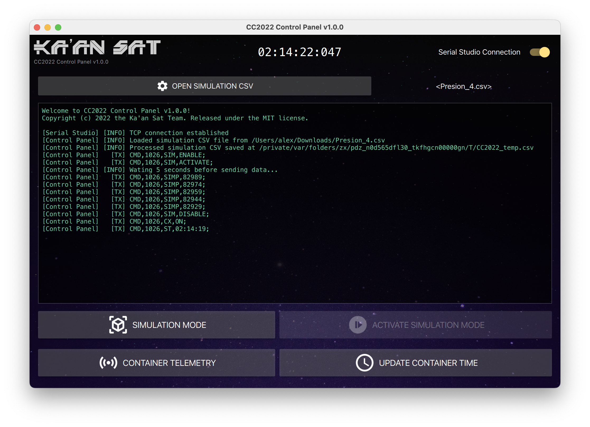

# CanSat Competition 2022 Control Panel

Serial Studio companion application that allows users to send simulated pressure data to the CanSat container & control scientific payload operations.

## License

This project is released under the MIT license. For more information, click [here](LICENSE.md).
